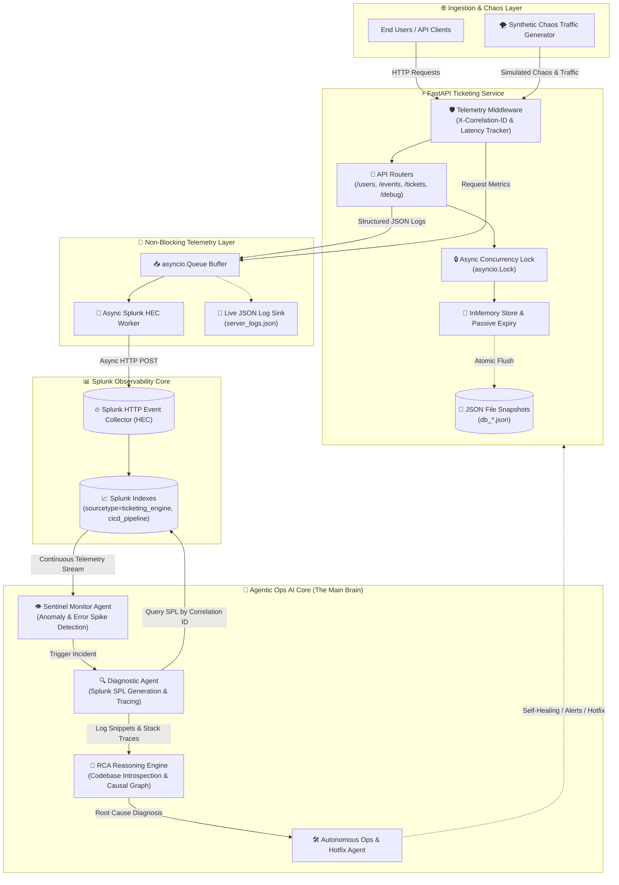
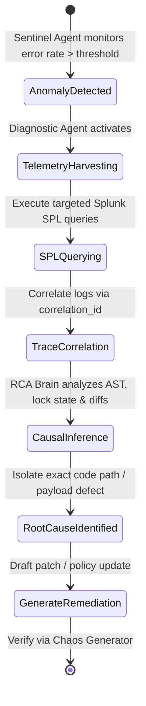
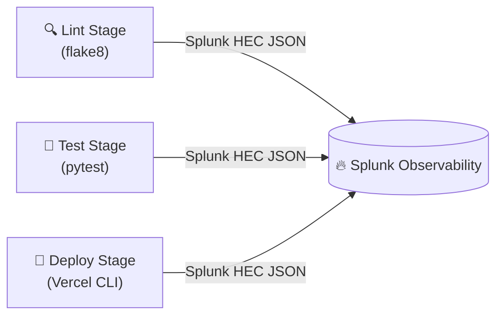

<div align="center">

```
 _____ _     _        _     ____              _    _             
|_   _(_)___| | _____| |_  | __ )  ___   ___ | | _(_)_ __   __ _ 
  | | | / __| |/ / _ \ __| |  _ \ / _ \ / _ \| |/ / | '_ \ / _` |
  | | | \__ \   <  __/ |_  | |_) | (_) | (_) |   <| | | | | (_| |
  |_| |_|___/_|\_\___|\__| |____/ \___/ \___/|_|\_\_|_| |_|\__, |
                                                            |___/ 
      ____                                            
     / ___|  ___ _ ____   _____ _ __                  
     \___ \ / _ \ '__\ \ / / _ \ '__|                 
      ___) |  __/ |   \ V /  __/ |                    
     |____/ \___|_|    \_/ \___|_|                    
  ⚡ REAL-TIME TELEMETRY • SPLUNK HEC • AGENTIC OPS RCA ⚡
```

# 🎫 Real-Time Event Ticketing Engine & Agentic Ops Sandbox

[](https://fastapi.tiangolo.com)
[](https://python.org)
[](https://www.splunk.com)
[](https://docs.python.org/3/library/asyncio.html)
[](https://www.docker.com)
[](https://github.com)
[](https://github.com)

<p align="center">
  <b>A production-grade asynchronous microservice paired with non-blocking enterprise Splunk telemetry and an autonomous AI Agentic Ops framework for real-time Root Cause Analysis (RCA).</b>
</p>

---

</div>

## 📑 Table of Contents

- [🧠 System Paradigm: Microservice vs. Agentic Brain](#-system-paradigm-microservice-vs-agentic-brain)
- [✨ Key Architectural Highlights](#-key-architectural-highlights)
- [🏛️ System Architecture](#️-system-architecture)
- [🤖 Agentic Ops & Autonomous RCA Engine](#-agentic-ops--autonomous-rca-engine)
  - [The Multi-Agent RCA Triad](#the-multi-agent-rca-triad)
  - [Autonomous RCA Investigation Flow](#autonomous-rca-investigation-flow)
  - [Real-World RCA Scenarios & Playbooks](#real-world-rca-scenarios--playbooks)
- [📊 Enterprise Splunk HEC Telemetry](#-enterprise-splunk-hec-telemetry)
  - [Non-Blocking Async Ingestion Pipeline](#non-blocking-async-ingestion-pipeline)
  - [Distributed Tracing with Correlation IDs](#distributed-tracing-with-correlation-ids)
  - [Full-Spectrum CI/CD Pipeline Telemetry](#full-spectrum-cicd-pipeline-telemetry)
  - [Essential Splunk SPL Queries for RCA](#essential-splunk-spl-queries-for-rca)
- [💥 Synthetic Chaos & Traffic Generator](#-synthetic-chaos--traffic-generator)
- [⚙️ Core Server Mechanics](#️-core-server-mechanics)
- [🚀 Quickstart & Installation](#-quickstart--installation)
  - [Environment Configuration](#environment-configuration)
  - [Running Locally](#running-locally)
  - [Running the Chaos Traffic Generator](#running-the-chaos-traffic-generator)
  - [Running Automated Tests](#running-automated-tests)
  - [Docker Container Deployment](#docker-container-deployment)
- [📡 API Documentation & Endpoints](#-api-documentation--endpoints)
- [📂 Repository Structure](#-repository-structure)
- [🛡️ Security & Quality Standards](#️-security--quality-standards)

---

## 🧠 System Paradigm: Microservice vs. Agentic Brain

> [!IMPORTANT]
> **Understanding the Dual Architecture:**
> 
> * **The Ticket Booking Server** is a **realistic simulation target & demo workload**. It models high-concurrency seat reservation, inventory locking, race conditions, passive ticket expiry, and payment webhook reconciliation.
> * **The Agentic Ops Framework** is the **core intelligence ("The Main Brain")**. It ingests the rich telemetry stream generated by the server into Splunk, detects anomalies in real-time, correlates distributed transactions, navigates failure domains, and performs autonomous **Root Cause Analysis (RCA)** with surgical remediation playbooks.

```
┌─────────────────────────────────────────────────────────────────────────────┐
│                            AGENTIC OPS BRAIN                                │
│                                                                             │
│   ┌──────────────────┐    ┌──────────────────┐    ┌─────────────────────┐   │
│   │  Sentinel Agent  │───>│ Diagnostic Agent │───>│   RCA Solver AI     │   │
│   │ (Anomaly Stream) │    │  (Splunk SPL/Ctx)│    │(Root Cause Analysis)│   │
│   └──────────────────┘    └──────────────────┘    └─────────────────────┘   │
│            ▲                                                 │              │
│            │ Telemetry Stream (Splunk HEC)                   │ Remediation  │
│            │                                                 ▼ Actions      │
│  ┌───────────────────────────────────────────────────────────────────────┐  │
│  │                    TICKETING ENGINE (TARGET WORKLOAD)                 │  │
│  │                                                                       │  │
│  │   [FastAPI] ──> [Atomic Lock Engine] ──> [Passive Expiry] ──> [Store] │  │
│  │       ▲                                                               │  │
│  │       │ Chaos Traffic & Fault Injections                              │  │
│  │   [Synthetic Traffic Generator] (401 Auth / 400 Bad Amt / 404 Leaks)  │  │
│  └───────────────────────────────────────────────────────────────────────┘  │
└─────────────────────────────────────────────────────────────────────────────┘
```

---

## ✨ Key Architectural Highlights

* ⚡ **High-Throughput Async Core:** Built on FastAPI and Python 3.11+ async runtime with native `asyncio.Lock` preventing overselling race conditions under severe concurrency.
* 📡 **Direct Splunk HEC Streaming:** Zero-sidecar telemetry. Log events are queued into an in-memory `asyncio.Queue` and batched asynchronously over `httpx.AsyncClient` directly to Splunk Cloud/Enterprise HTTP Event Collector.
* 🧵 **Unified Distributed Tracing:** Context-propagated `correlation_id` attached to every inbound HTTP request, background worker task, database flush, and CI/CD pipeline stage.
* 🤖 **AI-Driven Autonomous RCA:** Structured telemetry formatted specifically for LLM-based Ops agents to parse causal dependency graphs, isolate root causes within milliseconds, and recommend zero-downtime hotfixes.
* ⏳ **Passive O(1) Expiry Mechanism:** Eliminates heavy background polling cron daemons by evaluating seat reservations lazily during entity access with instant inventory re-pooling.
* 🎯 **CI/CD Observability:** GitHub Actions workflow streams build, lint, test, and Vercel deployment logs directly to Splunk HEC with commit SHAs and execution statuses.
* 🌪️ **Chaos-Ready Traffic Generator:** Integrated workload simulator that continuously fires legitimate transactions interspersed with controlled anomalies (price tampering, password collisions, ghost events).

---

## 🏛️ System Architecture



---

## 🤖 Agentic Ops & Autonomous RCA Engine

In high-throughput distributed microservices, debugging incidents through manual log scanning is too slow. This repository implements the telemetry substrate required for **Autonomous Agentic Site Reliability Engineering (Agentic SRE)**.

### The Multi-Agent RCA Triad



1. **👁️ Sentinel Agent (Real-time Stream Observer):**
   * Continuously evaluates telemetry feeds from Splunk indexers.
   * Tracks metrics: 5xx server spikes, 401 credential exhaustion, 400 validation anomalies, and 99th percentile response latencies.
2. **🔍 Diagnostic Agent (Context & Telemetry Query Specialist):**
   * Once an incident is flagged, synthesizes optimized Splunk Search Processing Language (SPL) queries.
   * Isolates specific `correlation_id` threads and aggregates temporal telemetry across dependent microservices and CI/CD build runs.
3. **🧬 RCA Reasoning Engine (Causal Logic & Codebase Introspection):**
   * Ingests the contextual log bundle and maps runtime stack traces directly to the FastAPI route definitions, database locks, and validation schemas.
   * Differentiates transient network noise from systemic flaws (e.g. race conditions during ticket booking vs. malformed payment payloads).
4. **🛠️ Remediation & Verification Agent:**
   * Outputs structured RCA post-mortems with exact code line references, root cause explanations, and proposed code patches.
   * Triggers the `traffic_generator` to run synthetic chaos suites and verify regression elimination.

---

### Real-World RCA Scenarios & Playbooks

The included microservice and traffic generator are designed to trigger rich failure modes for the AI Agent to diagnose:

| Incident Type | Trigger Scenario | Telemetry Signal in Splunk | Autonomous RCA Deduction |
| :--- | :--- | :--- | :--- |
| **💥 Payment Mismatch** | Webhook receives `amount_paid` different from `total_cost` | `HTTP Request Failed` (400) + `"Payment amount does not match booking total cost"` | **Root Cause:** Client-side payment gateway truncation or currency conversion mismatch prior to webhook delivery. |
| **🔒 Inventory Contention** | Multiple simultaneous bookings for the same final ticket | Log entries with `Requested quantity exceeds available seat capacity` | **Root Cause:** Legitimate seat exhaustion handled safely by `asyncio.Lock` atomic checks. Zero overbooking confirmed. |
| **⏰ Expired Booking Re-Attempt** | Payment attempted after 10-minute hold window | `HTTP 400` + `"Booking has expired."` | **Root Cause:** Passive expiration successfully reclaimed inventory to the global pool before payment settlement. |
| **🚨 Authentication Brute Force** | High volume of booking requests with invalid password hashes | Cluster of 401s under the same `username` with differing timestamps | **Root Cause:** Credential stuffing attempt or unsynchronized client auth token. |
| **👻 Ghost Entity Probing** | Requests targeting non-existent event IDs or users | High frequency 404s on `/events/{id}` and `/tickets/book` | **Root Cause:** Stale cache on client or unauthorized resource scraping. |

---

## 📊 Enterprise Splunk HEC Telemetry

### Non-Blocking Async Ingestion Pipeline

Traditional logging frameworks block the application event loop when performing HTTP network I/O to remote logging endpoints. The Ticketing Engine uses an **asynchronous producer-consumer architecture**:

1. **Structured Log Generation:** When `logger.info()` or `logger.error()` is called, `CustomJsonFormatter` serializes the record into an ISO-8601 UTC-stamped JSON payload with application context.
2. **Lockless Enqueueing:** The log string is pushed into an internal `asyncio.Queue` in constant time ($O(1)$).
3. **Background Worker Dispatch:** A dedicated asyncio task (`SplunkHECHandler._flush_queue`) batches pending records and transmits them via HTTP POST to Splunk's `/services/collector/event` endpoint with keep-alive connection pooling.
4. **Graceful Fallback:** If Splunk HEC is unreachable, logs automatically fallback to stdout and the local `server_logs.json` without crashing or lagging the core business logic.

```python
# Sample Telemetry Record Emitted to Splunk HEC
{
  "timestamp": "2026-08-31T10:15:30.412891Z",
  "level": "ERROR",
  "logger_name": "ticketing_engine",
  "filename": "tickets.py",
  "correlation_id": "7b23f81e-9a1c-4b55-891d-56a89c9e88b2",
  "app_name": "Real-Time Event Ticketing Engine",
  "message": "Payment amount mismatch",
  "method": "POST",
  "path": "/api/v1/tickets/payment",
  "status_code": 400,
  "latency_ms": 3.42,
  "expected": 150.0,
  "received": 140.0
}
```

---

### Distributed Tracing with Correlation IDs

Every inbound request is intercepted by `telemetry_middleware`. If the client passes an `X-Correlation-ID` header, it is adopted; otherwise, a cryptographic UUIDv4 is generated.

The correlation ID is stored in Python's `contextvars.ContextVar`, allowing any downstream function, database transaction, or exception handler to automatically bind the ID to outgoing logs without manual parameter passing.

---

### Full-Spectrum CI/CD Pipeline Telemetry

Telemetry does not stop at runtime. The GitHub Actions workflow (`.github/workflows/main.yml`) captures outputs from every deployment phase and ships them to Splunk HEC:



---

### Essential Splunk SPL Queries for RCA

Use these pre-built Splunk Search Processing Language (SPL) queries for incident response:

```spl
# 1. Trace a complete transaction lifecycle across all endpoints
index=* sourcetype="ticketing_engine" correlation_id="YOUR_CORRELATION_ID_HERE"
| table timestamp, level, filename, message, method, path, status_code, latency_ms

# 2. Identify Top 5 Failure Routes in the last 1 hour
index=* sourcetype="ticketing_engine" status_code>=400
| stats count by path, status_code, message
| sort - count

# 3. Detect 95th and 99th percentile API latency degradation
index=* sourcetype="ticketing_engine" method=*
| timechart span=5m p50(latency_ms) as p50, p95(latency_ms) as p95, p99(latency_ms) as p99 by path

# 4. Find all CI/CD Pipeline Failures with Commit SHAs
index=* sourcetype="cicd_pipeline" event.status="failure"
| table event.pipeline, event.stage, event.repository, event.commit_sha, event.logs
```

---

## 💥 Synthetic Chaos & Traffic Generator

Located in [`traffic_generator/generate_traffic.py`](file:///c:/ticket%20booking%20server/traffic_generator/generate_traffic.py), this tool generates realistic user behaviors and chaotic failure injections to continuously fuel Splunk with telemetry for the AI Agent:

* 👤 **User Registration Flow:** Random string generation with 20% intentional username collision to trigger 400s.
* 🎟️ **Event Creation:** Dynamic capacity and pricing with 10% negative capacity injections.
* 🎫 **Ticket Booking with Chaos Injection:**
  * 10% invalid password attempts (`401 Unauthorized`).
  * 10% non-existent user lookups (`404 Not Found`).
  * 10% ghost event reservations (`404 Not Found`).
  * 70% valid bookings resulting in `PENDING_PAYMENT` state.
* 💳 **Payment Webhook Reconciliation:**
  * 10% tampered payment totals (`400 Bad Request`).
  * 10% failed payment status webhooks.
  * 10% fabricated booking IDs.
  * 70% confirmed ticket settlements.

---

## ⚙️ Core Server Mechanics

### 1. Atomic Concurrency Lock
To prevent overselling when multiple concurrent requests attempt to book the last available seats:
```python
async with db.lock:
    if event["available_seats"] < booking_req.quantity:
        raise HTTPException(status_code=400, detail="Requested quantity exceeds capacity")
    event["available_seats"] -= booking_req.quantity
    # Persist state atomically
    await db.save_to_disk()
```

### 2. Passive Expiration Model
Instead of running a heavy background thread continuously polling the database for expired tickets, the engine validates expiration lazily upon entity access:
$$\text{If } \text{status} = \text{PENDING\_PAYMENT} \quad \text{and} \quad t_{\text{current}} > t_{\text{expires\_at}} \implies \text{status} \leftarrow \text{EXPIRED}, \quad \text{seats} \leftarrow \text{seats} + \text{quantity}$$

---

## 🚀 Quickstart & Installation

### Prerequisites
* **Python 3.11+**
* **Git**
* **Splunk Cloud / Enterprise** (Optional for live HEC streaming; local JSON fallback is enabled by default)

### Environment Configuration

Copy the example environment file:
```bash
cp .env.example .env
```

Edit `.env` with your Splunk credentials:
```ini
SPLUNK_HEC_URI=https://<your-instance>.splunkcloud.com:8088/services/collector/event
SPLUNK_HEC_TOKEN=your-hec-token-here
DEBUG=True
APP_NAME=Real-Time Event Ticketing Engine
```

---

### Running Locally

1. **Create and activate a virtual environment:**
   ```bash
   python -m venv .venv
   # Windows:
   .venv\Scripts\activate
   # Linux/macOS:
   source .venv/bin/activate
   ```

2. **Install dependencies:**
   ```bash
   pip install -r requirements.txt
   ```

3. **Start the server:**
   ```bash
   python run_server.py
   ```
   *The server will start at `http://127.0.0.1:8000` with interactive Swagger docs at `http://127.0.0.1:8000/docs`.*

---

### Running the Chaos Traffic Generator

Open a separate terminal window and launch the traffic simulator:
```bash
python -m traffic_generator.generate_traffic
```
*Observe real-time logs streaming both in the terminal, in `server_logs.json`, and across your Splunk dashboard.*

---

### Running Automated Tests

Execute the comprehensive test suite with coverage:
```bash
python run_tests.py
# or directly with pytest
pytest tests/ -v
```

---

### Docker Container Deployment

Build and run using the optimized multi-stage Dockerfile:

```bash
# Build the Docker image
docker build -t ticketing-engine:latest .

# Run container with environment file
docker run -d -p 8000:8000 --env-file .env --name ticketing-app ticketing-engine:latest

# Check container logs
docker logs -f ticketing-app
```

---

## 📡 API Documentation & Endpoints

| Method | Endpoint | Description | Auth / Body |
| :--- | :--- | :--- | :--- |
| `POST` | `/api/v1/users/register` | Register a new user with hashed credentials | `{ "username", "password" }` |
| `POST` | `/api/v1/events` | Create a new event and allocate seating pool | `{ "event_name", "total_capacity", "ticket_price" }` |
| `GET` | `/api/v1/events` | List all active events and available capacity | Public |
| `GET` | `/api/v1/events/{id_or_name}` | Retrieve real-time event status and seat count | Public |
| `POST` | `/api/v1/tickets/book` | Reserve tickets with 10-minute hold lock | `{ "event_name", "username", "password", "quantity" }` |
| `POST` | `/api/v1/tickets/payment` | Webhook for payment reconciliation & confirmation | `{ "booking_id", "transaction_reference", "amount_paid", "status" }` |
| `POST` | `/api/v1/tickets/cancel/{id}` | Cancel a pending reservation and return seats | Public |
| `GET` | `/api/v1/debug/data` | Export active database state snapshot | Debug / Admin |

---

## 📂 Repository Structure

```
├── .github/
│   └── workflows/
│       └── main.yml           # CI/CD Pipeline streaming Lint/Test/Deploy logs to Splunk HEC
├── api/
│   └── index.py               # Vercel serverless entrypoint
├── app/
│   ├── core/
│   │   ├── config.py          # Pydantic Settings & environment validation
│   │   ├── database.py        # Thread-safe InMemoryDB with JSON file persistence
│   │   └── logger.py          # Custom Splunk HEC Async Handler & JSON Formatter
│   ├── routers/
│   │   ├── debug.py           # Debug telemetry & state inspection routes
│   │   ├── events.py          # Event creation, capacity lookup, and metadata
│   │   ├── tickets.py         # Concurrency locking, booking, payment, and expiry
│   │   └── users.py           # User registration and SHA-256 password hashing
│   ├── schemas/
│   │   └── schemas.py         # Strict Pydantic request/response models
│   └── main.py                # FastAPI app initialization, middleware, and lifecycle hooks
├── docs/
│   └── architecture_workflow.md # Architectural workflow deep-dive
├── tests/
│   └── test_api.py            # Comprehensive test suite covering all routes & edge cases
├── traffic_generator/
│   └── generate_traffic.py    # Synthetic chaos & traffic engine for Agentic RCA training
├── .env.example               # Template environment configuration
├── .gitignore                 # Optimized Git exclusions
├── Dockerfile                 # Multi-stage production container build
├── render.yaml                # Render Cloud infrastructure-as-code specification
├── requirements.txt           # Production & testing dependencies
├── run_server.py              # Local server launch runner
├── run_tests.py               # Automated test execution script
└── vercel.json                # Vercel serverless deployment routing
```

---

## 🛡️ Security & Quality Standards

* 🔒 **Password Security:** Credentials are salted and hashed using SHA-256 before disk persistence.
* 🛡️ **Zero Race Conditions:** Critical state mutations are isolated within exclusive asynchronous locks.
* 🛑 **Non-Blocking Telemetry:** The logging worker runs in a decoupled queue, preventing telemetry latency from impacting user request SLAs.
* 🧼 **Clean Git Management:** Sensitive files (`.env`), runtime cache files (`__pycache__`), test dumps, and deployment artifacts are strictly excluded via `.gitignore`.

---

<div align="center">
  <b>Built for Next-Generation Autonomous SRE & Agentic Operations ⚡</b>
</div>
